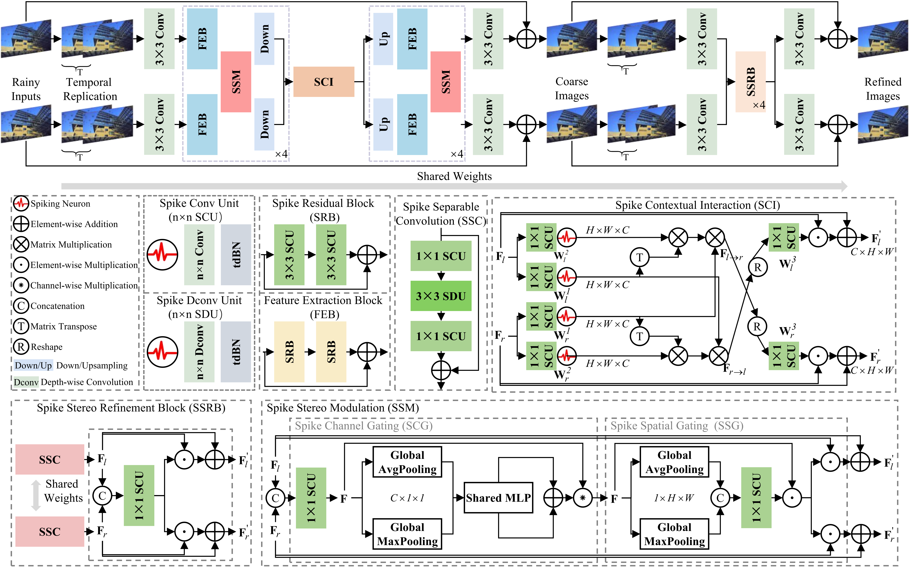
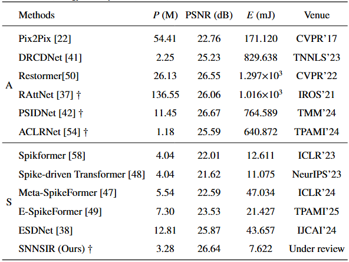
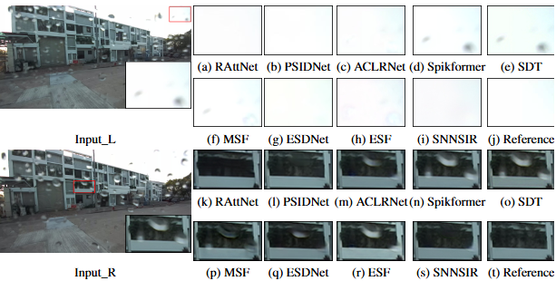

# SNNSIR: A Fully Spiking Neural Network for Stereo Image Restoration

[📝 Paper (Placeholder)] | [🗃️ Datasets (Placeholder)] | [💻 Pre-trained Weights (Placeholder)]

This repository contains the official PyTorch implementation of **SNNSIR**: A Fully Spiking Neural Network for Stereo Image Restoration. 

## 📖 Abstract
Spiking Neural Networks (SNNs) offer high computational efficiency and low energy consumption, making them attractive for computation-intensive vision tasks. However, building a fully spiking model for stereo image restoration remains challenging due to the limited representation capability of fully spiking networks and the difficulty of effective cross-view information integration. 

In this work, we propose **SNNSIR**, a fully spiking neural network for stereo image restoration. The entire network is built under a spike-driven paradigm, where information is transmitted through sparse event-based spikes without relying on continuous activation functions. To enhance representation and cross-view information integration, we develop three complementary modules:
* **Spike Residual Block (SRB):** Introduces spike-compatible residual learning to alleviate information attenuation.
* **Spike Stereo Modulation (SSM):** Employs spike-friendly multiplicative modulation to adaptively emphasize degradation-relevant regions.
* **Spike Stereo cross-Attention (SSA):** Establishes effective cross-view interaction to aggregate complementary information.

Extensive experiments demonstrate that SNNSIR achieves state-of-the-art performance among SNN-based methods and competitive performance to ANN-based methods, while consuming approximately **two orders of magnitude less energy**.



---

## Results





## ⚙️ Dependencies and Installation

1. Create a Conda environment and activate it:
```bash
conda create -n snnsir python=3.10
conda activate snnsir
```

1. Install PyTorch and other primary dependencies:

```
pip install torch==2.9.1 torchvision==0.24.1 torchaudio==2.9.1 --index-url [https://download.pytorch.org/whl/cu128](https://download.pytorch.org/whl/cu128)
pip install spikingjelly==0.0.0.0.14
```

1. Install the remaining requirements:

```
pip install -r requirements.txt
```

------

## 🗂️ Directory Structure & Datasets

Please prepare the datasets and organize the project directory as follows:

Plaintext

```
SNNSIR/
├── checkpoints/
│   └── SCASDNet/
│       └── yyyy-mm-dd-hh-mm-ss/  # Pre-trained weights and test results
├── configs/                      # Model configuration (.yml) files
├── models/                       # Model architectures
├── utils/                        # Utility scripts
└── data/                         # Datasets directory
    ├── StereoWaterdrop/
    │   ├── train/ (gt, input)
    │   ├── val/
    │   └── test/
    ├── Middlebury/
    ├── holopix50k/
    ├── RainKT12/
    │   ├── train/
    │   └── test/
    ├── RainKT15/
    └── NAFSSR/
```

*(Note: Please refer to our dataset instructions to download and prepare the data.)*

------

## 📦 Pre-trained Models

You can download the pre-trained weights from [link](https://pan.baidu.com/s/1EeSkXi8bowwPyXo79i_VEg?pwd=boyh) (Access Code: **boyh**).

After downloading, please extract and save the weights at `./checkpoints/SNNSIR/xxxx-xx-xx-xx-xx-xx/model_best.pth`. You can find the exact date directory name in the corresponding `.yml` configuration file under `['path']['saved_path']`.

------

## 🚀 Usage

### 1. Stereo Image Restoration

*(Tasks include: StereoWaterdrop, RainKT12, RainKT15, Middlebury, and holopix50k. Just replace the corresponding `.yml` file.)*

**Training:**

```
python train_snn.py --opt ./configs/unet5_wwLifMul_1CAM_snn_waterdrop_32to160_vth02_SRBB_SSCM_SSCA_SSRB_1e3_4_c32.yml
```

**Testing (PSNR/SSIM Evaluation):**

```
python test_snn.py --opt ./configs/unet5_wwLifMul_1CAM_snn_waterdrop_32to160_vth02_SRBB_SSCM_SSCA_SSRB_1e3_4_c32.yml
```

**Energy Consumption Evaluation (Energy per frame = E/T):**

```
python test_snn_energy.py --opt ./configs/unet5_wwLifMul_1CAM_snn_waterdrop_32to160_vth02_SRBB_SSCM_SSCA_SSRB_1e3_4_c32.yml
```

### 2. Super-Resolution

**Training:**

```
python train_snn_sr.py --opt ./configs/unet5_wwLifMul_1CAM_snn_sr_32to160_vth02_SRBB_SSCM_SSCA_SSRB_1e3_4_c32.yml
```

**Testing:**

```
python test_snn_sr.py --opt ./configs/unet5_wwLifMul_1CAM_snn_sr_32to160_vth02_SRBB_SSCM_SSCA_SSRB_1e3_4_c32.yml
```

**Energy Consumption Evaluation:**

```
python test_snn_energy_sr.py --opt ./configs/unet5_wwLifMul_1CAM_snn_sr_32to160_vth02_SRBB_SSCM_SSCA_SSRB_1e3_4_c32.yml
```

## 📄 License

This project is licensed under the [MIT License](https://www.google.com/search?q=LICENSE) - see the https://www.google.com/search?q=LICENSE file for details.
